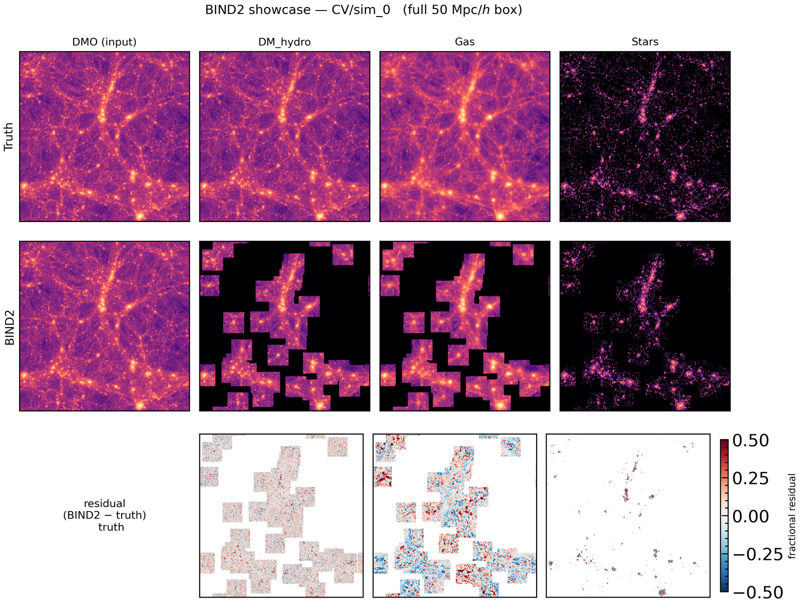
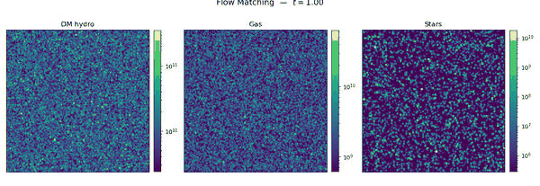
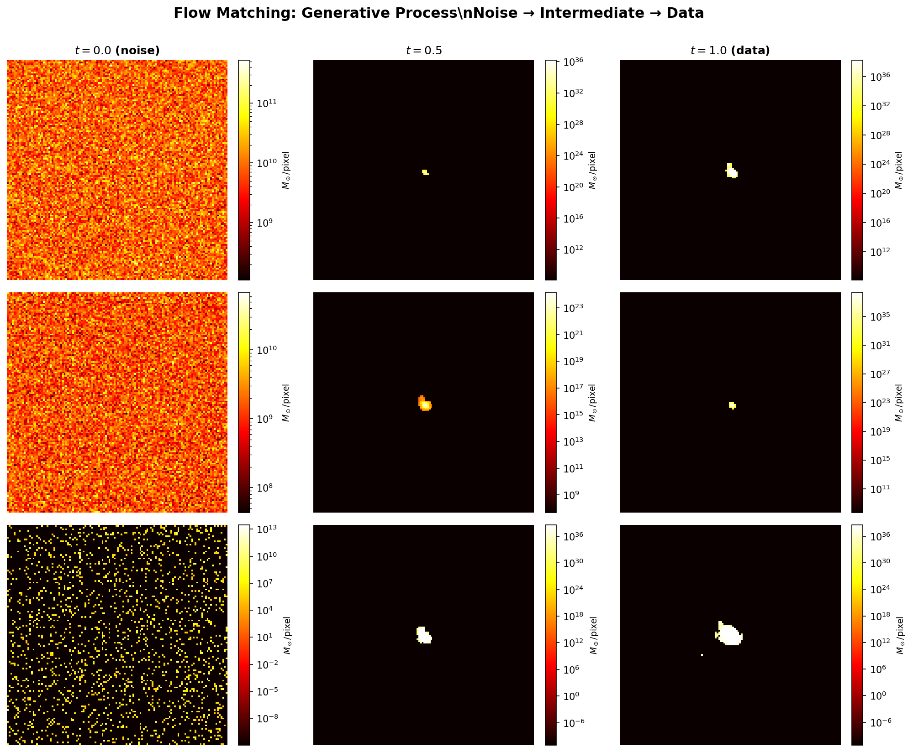

# BIND — paint baryons onto your N-body simulation

[](https://bind.readthedocs.io/en/latest/)
[](LICENSE)

**B**aryons **I**nduced via **N**eural **D**iffusion — a flow-matching emulator
that takes a dark-matter-only (DMO) snapshot, plus a 35-dim
cosmology-and-astrophysics parameter vector, and returns the corresponding
hydro fields `[DM_hydro, Gas, Stars]` as projected mass maps.

It is *fast* (one forward pass per ~50 Mpc/h slab), *probabilistic* (samples
from the posterior over hydro fields given DMO + parameters), and *scalable*
(applies tile-by-tile to boxes much larger than the 50 Mpc/h training box —
e.g. a 205 Mpc/h N-body simulation is just 64 tiles).

<p align="center">
  
</p>
<p align="center">
  
</p>

📖 **Documentation:** [bind.readthedocs.io](https://bind.readthedocs.io)
🤗 **Pretrained weights:** [`Maxelee/BIND2`](https://huggingface.co/Maxelee/BIND2)
📝 **Paper:** Lee et al., in prep.

---

## Why BIND?

Running a hydrodynamic simulation is expensive. Running an N-body simulation is
~10–100× cheaper but gives you *only the dark-matter field*. BIND closes that
gap: train once on CAMELS-IllustrisTNG, then **paint baryons onto any DMO
simulation** of comparable resolution at near-zero cost.

It is a conditional generative model: given a DMO column-density patch and a
35-dim parameter vector, the network samples a hydro field consistent with the
training simulations. You can therefore

- generate plausible hydro fields for boxes you've only run with N-body,
- explore the posterior by drawing multiple samples,
- forecast how your sim would look under different feedback prescriptions by
  varying the parameter vector while keeping the DMO field fixed.

---

## Install

```bash
pip install git+https://github.com/Maxelee/BIND.git
# or, for development:
git clone https://github.com/Maxelee/BIND.git
cd BIND && pip install -e .
```

Python ≥ 3.10, PyTorch ≥ 2.0. The
[Pylians](https://github.com/franciscovillaescusa/Pylians3) `MAS_library` is a
hard dependency (used for mass-conserving CIC pixelization).

```bash
bind-download-weights fm_two_head      # ~950 MB into weights/fm_two_head/
```

---

## The 30-second story: "I have a 205 Mpc/h N-body simulation"

Suppose you have an N-body snapshot saved in Gadget/Arepo HDF5 format with a
matching FoF/Subfind catalog. To produce hydro maps for the whole box:

```python
import bind

sim    = bind.Simulation.from_paths(
    snapshot      = "snap_090.hdf5",            # any Gadget/Arepo HDF5 DMO snapshot
    group_catalog = "fof_subhalo_tab_090.hdf5",
    halo_mass_min = 1e13,                       # M200c cut [Msun/h]
)

model  = bind.Model.from_local("weights/fm_two_head")

result = bind.paint(
    sim, model,
    params      = bind.fiducial_params(),       # or random_params() / vary_param(...)
    output_dir  = "bind_output/run1",
)
```

That's it. For a 205 Mpc/h box at the native trained resolution this writes
~5 slabs of `(3, 4096, 4096)` hydro composites under `output_dir/`, plus a
`summary.json`. Each `.npz` contains the DMO input, the BIND composite
`[DM_hydro, Gas, Stars]`, the per-halo cutouts, and the halo bookkeeping —
ready to project, profile, or compute summary statistics on.

Same thing from the shell:

```bash
bind-paint --snapshot snap_090.hdf5 \
           --group_catalog fof_subhalo_tab_090.hdf5 \
           --params my_params.npy \
           --run_dir weights/fm_two_head \
           --output_dir bind_output/run1
```

Don't have parameters? Use the bundled CAMELS-IllustrisTNG fiducial:

```python
params = bind.fiducial_params()                              # (35,)
params = bind.random_params(n=1, rng=0)                      # uniform draw from prior
params = bind.vary_param("RadioFeedbackFactor", fraction=1.0)  # max-AGN
```

See [`examples/paint_walkthrough.ipynb`](examples/paint_walkthrough.ipynb) for
the full end-to-end notebook.

---

## How it works

BIND is a **conditional Optimal-Transport flow-matching** model. Concretely the
network learns a velocity field $v_\theta(x_t, t \mid \mathrm{DMO}, \theta)$
such that integrating

$$
\frac{d x_t}{d t} = v_\theta(x_t, t \mid \mathrm{DMO}, \theta_\mathrm{cosmo+astro}),
\quad x_0 \sim \mathcal{N}(0, I), \quad x_1 = \mathrm{hydro\ patch},
$$

transports a Gaussian sample at $t=0$ into a hydro patch at $t=1$ that is
consistent with the conditioning DMO patch and parameter vector. At inference
we simply solve this ODE with ~50 Euler steps.

<p align="center">
   data"/>
</p>

### Training data

- **CAMELS IllustrisTNG SB35** — 1024 hydrodynamic simulations spanning a
  35-parameter space (cosmology + astrophysics), plus the 27-element 1P / CV
  sets. 50 Mpc/h boxes, $512^3$ particles, $z=0$.
- For each pair (DMO, hydro) we project the particles to $1024^2$ pixel maps
  with a 50 kpc/h pixel size (Pylians CIC) and extract halo-centered $128^2$
  patches.
- Channels: `[DM_hydro, Gas, Stars]`. Stars uses a **two-head**
  parameterization — `(occupancy, conditional log-density)` — to handle the
  hard zero-pixel structure of the stellar field.

### Model

- UNet ($\sim$56 M params) with `AdaGroupNorm` conditioning. The 35-dim
  parameter vector and a sinusoidal time embedding are summed and feed scale +
  shift into every residual block.
- Input channels: `[noisy hydro patch, DMO conditioning patch,
  3 large-scale context patches]`. The large-scale channels carry box-level
  information (halo environment, local mass density, cosmic web).
- Output channels: 3 (or 4, in two-head Stars mode).

### Training

- 8× H100, DDP, bf16, EMA decay = 0.9999.
- AdamW, linear-warmup → cosine LR schedule, gradient clipping.
- Loss: $\| v_\theta(x_t, t \mid c) - (x_1 - x_0) \|^2_2$ at OT-coupled
  $(x_0, x_1)$ pairs and uniformly sampled $t \in [0, 1]$.

### Inference at scale

For a box of side $L$ Mpc/h, BIND tiles into $\lceil L / 50 \rceil$ z-slabs,
projects DMO particles per slab, runs the model on every halo above
`halo_mass_min`, and pastes the per-halo hydro patches back into a global
canvas with a smooth taper. **DM_hydro** uses the DMO map as a fallback
outside the patches (it's a good predictor at large scales); **Gas** and
**Stars** are zero outside patches by construction. A global rescale enforces
mass conservation.

See the [ReadTheDocs site](https://bind.readthedocs.io) for the full details,
ablations, and validation against held-out CAMELS sims.

---

## Public API

The whole user-facing surface is three classes and one function:

| object | role |
|---|---|
| `bind.Simulation`        | DMO particles + halo catalog (`from_paths` / `from_arrays`) |
| `bind.Model`             | trained checkpoint + normalization (`from_local` / `from_files`) |
| `bind.paint(sim, model, params, output_dir, ...)` | one call: project → cutouts → sample → composite → save |
| `bind.PaintResult`       | dataclass returned by `paint`; lists the `.npz` paths and a `summary.json` |

Plus parameter helpers exported at the top level:

| helper | use |
|---|---|
| `bind.fiducial_params()`               | the CAMELS-IllustrisTNG fiducial vector |
| `bind.random_params(n, rng=...)`       | uniform sample from the SB35 prior box (log10 where appropriate) |
| `bind.vary_param(name, value=...)`     | fiducial with one parameter overridden |
| `bind.vary_params({name: val, ...})`   | multi-parameter override |
| `bind.param_dataframe()`               | pandas table: name, fiducial, min, max, log flag, description |

See the API reference in the docs for full signatures.

---

## Repo layout

```
src/bind/
  __init__.py            top-level API surface
  params.py              parameter helpers + SB35 metadata
  model.py               UNet + FlowMatching / StochasticInterpolant
  data.py                NormStats, AstroDataset, CubeAstroDataset
  train.py               FlowMatchingLit (Lightning)
  metrics.py
  assets/                bundled SB35 parameter tables
  inference/             generic paint engine (paint, io_gadget, pipeline, runner)
  cli/                   console scripts (bind-paint, bind-camels-suite, ...)
  tools/                 release helpers (slim_checkpoint, download_weights)
examples/
  paint_walkthrough.ipynb   start here
  generate_demo.py          self-contained 128² demo
docs/                    Sphinx / ReadTheDocs source
weights/                 pretrained checkpoints (gitignored; populated by bind-download-weights)
```

Distinct analyses live on topic branches (`analysis/2d`, `feature/3d-cube`,
`feature/thermo`, `wip`). `main` is the clean trunk; `release/v0.1` is the
packaged release line.

---

## CLI reference

```bash
bind-paint           # paint a single snapshot
bind-camels-suite    # batch-generate over a CAMELS suite (CV / 1P / SB35)
bind-download-weights
bind-slim-checkpoint
```

Run any of them with `--help` for the full flag list.

---

## Citation

If you use BIND in published work, please cite:

```bibtex
@article{lee2024bind,
  title  = {BIND: Painting Baryons onto Dark Matter via Conditional Flow Matching},
  author = {Lee, Matthew Ho and others},
  year   = {in prep.}
}
```

## License

MIT — see [LICENSE](LICENSE).
