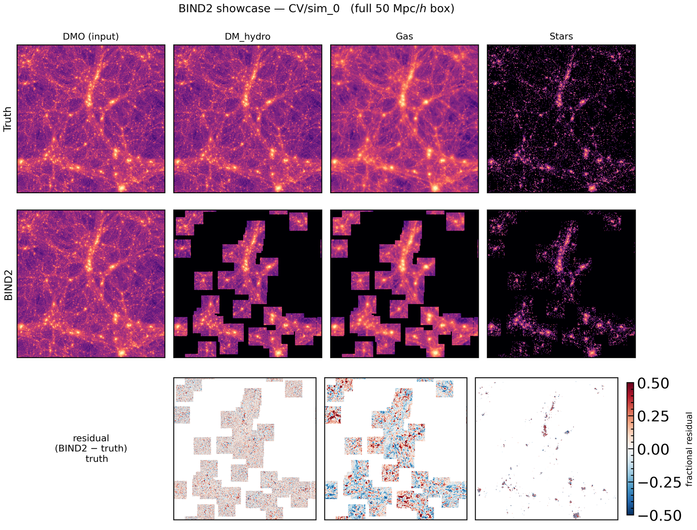
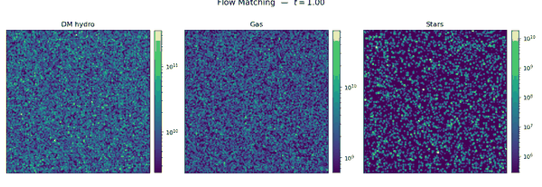
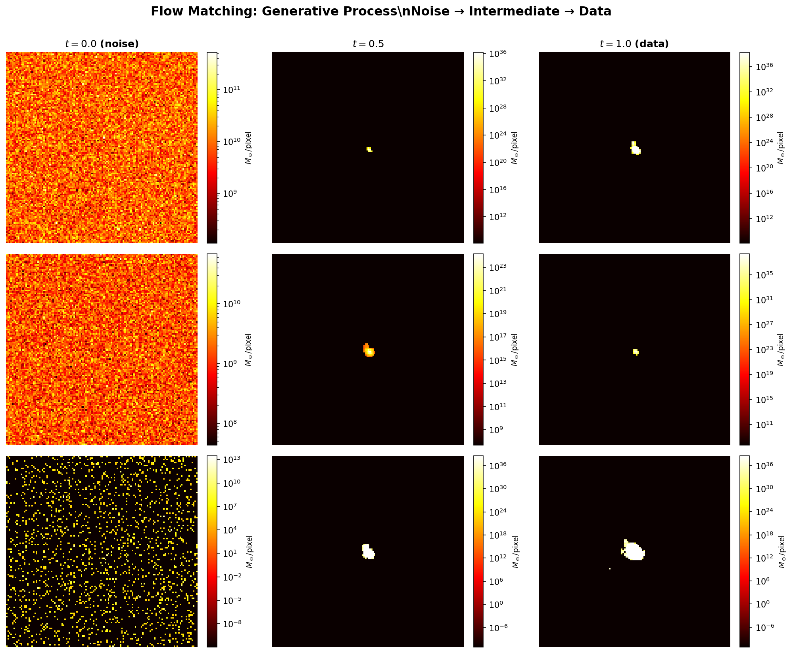

# BIND — paint baryons onto your N-body simulation

[](LICENSE)
[](pyproject.toml)
[](https://huggingface.co/mel2260/BIND)

**BIND** — **B**aryonic **IN**painting with **D**eep learning — is a conditional
flow-matching emulator that takes a dark-matter-only (DMO) halo patch plus a
35-dimensional cosmology-and-astrophysics parameter vector, and samples the
corresponding hydrodynamic fields `[DM_hydro, Gas, Stars]` as projected mass
maps. Redshift-conditioned checkpoints additionally take the scale factor
`a = 1/(1+z)`; thermo checkpoints additionally emit four gas-thermodynamic
fields (`compton_y`, `temperature`, `entropy`, `pressure` — the last is the
total thermal pressure, not the electron pressure).

It is *halo-centric* (the network works on 128×128 patches ≈ 6.25 Mpc/h across,
projected through a 50 Mpc/h slab, centred on halos), *probabilistic* (it samples
a posterior over hydro fields at fixed DMO + parameters rather than returning one
deterministic answer), and *deployable* (`bind.paint()` reads any Gadget/Arepo
HDF5 DMO snapshot, paints every halo above a mass floor, and composites the
patches back into a full-box map).

<p align="center">
  
</p>
<p align="center">
  
</p>

🤗 **Pretrained weights:** [`mel2260/BIND`](https://huggingface.co/mel2260/BIND)
(fetch with `bind-download-weights`)
📖 **Documentation:** the Markdown/Sphinx sources under [`docs/`](docs/) — start at
[`docs/quickstart.md`](docs/quickstart.md). *(A hosted docs site is not live yet;
`bind.readthedocs.io` belongs to an unrelated project — do not use it.)*
📝 **Methods paper:** Lee, Genel, Haiman & Bryan, *BIND (Baryonic INpainting with
Deep learning): A Field-level Emulator for Galaxy Groups and Clusters*.
**arXiv id: TBD** — this line will be updated when the preprint is posted.

---

## What you get / what you need

**You get**

- an installable Python package, imported as `bind` (install from git — the
  name `bind` on PyPI belongs to an unrelated project, so `pip install bind`
  is **not** this package);
- pretrained checkpoints from Hugging Face (`bind-download-weights`) — about
  about 1 GB for `fm_two_head` (995 MB measured); the thermo and redshift runs are
  larger because they carry extra output channels, so budget a few GB for all three;
- a one-call painting API, `bind.paint()`, plus CLIs for single snapshots,
  staged large-box runs, and CAMELS suite evaluation;
- the SB35 parameter metadata bundled in the wheel, so `bind.fiducial_params()`
  and friends work offline with no data download.

**You need**

- Python ≥ 3.10 and PyTorch ≥ 2.0 (a GPU for anything beyond a toy run);
- a DMO snapshot + FoF/Subfind halo catalog in Gadget/Arepo HDF5 format — *if*
  you want to paint your own simulation;
- **you do not need CAMELS data** for the demo path. `examples/generate_demo.py`
  runs end-to-end from the bundled `examples/data/dmo_sample.npz` and the
  downloaded weights. CAMELS data roots are only required for the
  `bind-camels-suite` evaluation pipeline and for retraining.

---

## Install

```bash
pip install git+https://github.com/Maxelee/BIND.git
```

or, for development:

```bash
git clone https://github.com/Maxelee/BIND.git
cd BIND
pip install -e .            # add [dev] for ruff + pytest
```

Optional extras (`pip install -e ".[extra]"` from a clone):

| extra | pulls in | needed for |
|---|---|---|
| `wlemu-fit` | gpytorch, scikit-learn | *fitting* the weak-lensing emulator; prediction is numpy-only |
| `mpi` | mpi4py | the distributed projection stage for very large boxes |
| `dev` | ruff, pytest | linting and tests |

[Pylians3](https://github.com/franciscovillaescusa/Pylians3) is a **hard**
dependency (declared as `Pylians`): its `MAS_library` does the mass-conserving
CIC pixelization and `Pk_library` the power spectra, and both are imported on the
`import bind` path.

Then fetch weights:

```bash
bind-download-weights fm_two_head       # mass channels only (the fiducial run)
bind-download-weights fm_thermo         # + 4 gas-thermo channels
bind-download-weights fm_redshift_thermo  # redshift-conditioned, mass + thermo
bind-download-weights                   # no argument = all three
```

They land in `weights/<run>/{last.ckpt,norm_stats.npz}`, which is the layout
`bind.Model.from_local()` and `bind-paint --run_dir` expect. `bind-camels-suite`
additionally needs `--checkpoint_path weights/<run>/last.ckpt`, because its
`--run_dir` default looks for the checkpoint under `<run_dir>/checkpoints/`. To pin a specific
upload for reproducibility, pass `--revision <sha>` (see
[Data & attribution](#data--attribution)).

Verify the install:

```bash
python -c "import bind; print(bind.__version__, bind.fiducial_params().shape)"
# 0.2.0 (35,)
python examples/generate_demo.py        # needs weights/fm_two_head
```

---

## The 30-second story: "I have a 205 Mpc/h N-body simulation"

Suppose you have an N-body snapshot saved in Gadget/Arepo HDF5 format with a
matching FoF/Subfind catalog. To produce hydro maps for the whole box:

```python
import bind

sim    = bind.Simulation.from_paths(
    snapshot      = "snap_090.hdf5",            # any Gadget/Arepo HDF5 DMO snapshot
    group_catalog = "fof_subhalo_tab_090.hdf5",
    halo_mass_min = 1e13,                       # M200c cut [Msun/h]
)

model  = bind.Model.from_local("weights/fm_two_head")

result = bind.paint(
    sim, model,
    params      = bind.fiducial_params(),       # or random_params() / vary_param(...)
    output_dir  = "bind_output/run1",
)
```

That's it. BIND cuts the box into `round(L / 50)` z-slabs and pixelizes each to
`round(L / pixel_size)` pixels a side, so a 205 Mpc/h box gives **4 slabs of
`(3, 4198, 4198)`** written as `composite_slab{NN}.npz` under `output_dir/`,
plus a `summary.json`. Each `.npz` carries the DMO input (`dmo`), the BIND
composite `[DM_hydro, Gas, Stars]` (`composite`), the paste weight map (`alpha`),
the per-halo patches (`generated_patches`, and `thermo_patches` for a thermo
model), the halo bookkeeping (`halo_centers`, `halo_masses`, `halo_r200`), and
the mass-conservation diagnostics (`patch_scales`, `scale_global`,
`coverage_pct`).

Same thing from the shell:

```bash
bind-paint --snapshot snap_090.hdf5 \
           --group_catalog fof_subhalo_tab_090.hdf5 \
           --params my_params.npy \
           --run_dir weights/fm_two_head \
           --output_dir bind_output/run1
```

Don't have parameters? Use the bundled CAMELS-IllustrisTNG fiducial:

```python
params = bind.fiducial_params()                                # (35,)
params = bind.random_params(n=1, rng=0)                        # uniform draw from the SB35 prior box
params = bind.vary_param("RadioFeedbackFactor", fraction=1.0)  # fiducial, one parameter at its prior max
```

See [`examples/paint_walkthrough.ipynb`](examples/paint_walkthrough.ipynb) for
the full end-to-end notebook, and
[`examples/paint_tng_results.ipynb`](examples/paint_tng_results.ipynb) for a
real large-box deployment.

### Very large boxes: the staged path

For boxes where projection and generation want different machines (CPU/MPI vs
GPU), run the three stages separately — the intermediate products are cached, so
you can recomposite with different paste settings without re-generating:

```bash
bind-paint-project     ...   # CPU (optionally MPI): particles -> z-slab maps + halo cutouts
bind-paint-generate    ...   # GPU: sample hydro patches for every halo
bind-paint-recomposite ...   # CPU: paste patches back into full-box maps
```

---

## How it works

BIND is a **conditional optimal-transport flow-matching** model. The network
learns a velocity field $v_\theta(x_t, t \mid \mathrm{DMO}, \theta)$ such that
integrating

$$
\frac{d x_t}{d t} = v_\theta(x_t, t \mid \mathrm{DMO}, \theta_\mathrm{cosmo+astro}),
\quad x_0 \sim \mathcal{N}(0, I), \quad x_1 = \mathrm{hydro\ patch},
$$

transports a Gaussian sample at $t=0$ into a hydro patch at $t=1$ consistent with
the conditioning DMO patch and parameter vector. At inference we solve this ODE
with 50 Euler steps (`n_steps=50`, the trained sweet spot).

<p align="center">
   data"/>
</p>

### Training data

- **CAMELS IllustrisTNG SB35** ([Genel et al. 2026](https://arxiv.org/abs/2606.10038)) —
  1024 *paired* hydrodynamic + N-body simulations, 50 Mpc/h boxes, $512^3$
  particles, spanning a 35-parameter space (5 cosmological + 30 IllustrisTNG
  subgrid) sampled with a Sobol sequence. Simulations are split 90/10
  train/test at the level of whole simulations. The 27-simulation CV set and the
  1P sets are used only for held-out evaluation.
- For each (DMO, hydro) pair the particles are projected onto $1024^2$ pixel maps
  (Pylians CIC, ~50 kpc/h pixels, i.e. `NATIVE_PIXEL_SIZE_MPCH = 50/1024`) and
  $128^2$ halo-centred patches are extracted for halos with
  $M_{200c} \ge 10^{13}\,M_\odot/h$.
- Channels: `[DM_hydro, Gas, Stars]`. Stars uses a **two-head** parameterization —
  `(occupancy, conditional log-density)` — to handle the hard zero-pixel structure
  of the stellar field, recombined at inference through a 0.5 occupancy gate.
- The released `fm_two_head` checkpoint is trained on the $z=0$ snapshot;
  `fm_redshift_thermo` is trained across eight snapshots ($z = 0$–$4$) and
  conditions on the scale factor.

### Model

- UNet, **248,860,548 parameters (~249 M)** for the released `fm_two_head`
  checkpoint: `base_ch=128`, `ch_mult=(1,2,4,8)`, 2 residual blocks per level,
  `emb_dim=512`, self-attention at 32² and 16².
- Conditioning is injected as **summed embeddings** — the parameter vector
  through a `ParamEncoder`, the flow time through a sinusoidal embedding, and
  (redshift models only) the scale factor through its own sinusoidal→MLP
  embedding. The sum drives `AdaGroupNorm` scale/shift inside every residual
  block.
- Input channels: `[noisy state, DMO conditioning patch, 3 large-scale context
  patches]` — 7 channels for a 3-output model, 8 for two-head Stars, plus 4 more
  in each of state and output for a thermo model. The large-scale channels carry
  box-level information (halo environment, local mass density, cosmic web).
- Output channels: 3, or 4 in two-head Stars mode, plus 4 gas-thermo channels
  with `--predict_thermo`.

### Training

- 8× H100, Lightning DDP, bf16 mixed precision, EMA decay = 0.9999.
- AdamW (`lr=1e-4`, `weight_decay=1e-4`), linear warmup → cosine LR, gradient
  clipping at 1.0.
- Loss: $\| v_\theta(x_t, t \mid c) - (x_1 - x_0) \|^2_2$ at OT-coupled
  $(x_0, x_1)$ pairs and uniformly sampled $t \in [0, 1]$.
- Note: the released `fm_two_head` checkpoint (epoch 80) stores only the raw
  weights — it carries **no** `ema_state_dict`, and the inference code
  correspondingly does not apply EMA to it.

### Inference at scale

For a box of side $L$ Mpc/h, BIND cuts it into `round(L/50)` z-slabs, CIC-projects
the DMO particles per slab, runs the model on every halo above `halo_mass_min`
(default $10^{13}\,M_\odot/h$), and pastes the per-halo hydro patches back into a
global canvas.

**Compositing defaults (the standard, since v0.2.0 at every entry point):**

| setting | default | meaning |
|---|---|---|
| `r200_factor` | `4.0` | circular Hann-tapered paste aperture of radius `4 × R200c` |
| `paste_mode`  | `"shared"` | overlapping halos agree on one realization of the shared region |
| `taper_frac`  | `0.15` | fraction of the aperture radius over which the weight tapers to 0 |
| `patch_mass_match` | `True` | rescale each generated patch so its total mass matches the DMO content over the same aperture |

`r200_factor = 0` selects the **legacy** square taper over the whole 128² patch
and `paste_mode = "average"` the **legacy** independent-patch blend, which loses
high-`k` power wherever apertures overlap: measured at **−10.6% total-matter
P(k) at k = 40–70 h/Mpc**, versus −0.8% for the circular aperture. See
[`docs/circular_aperture.md`](docs/circular_aperture.md) for the numbers. If you
have scripts written against v0.1.0 that relied on the old defaults, see
[CHANGELOG.md](CHANGELOG.md).

The **DM_hydro** channel of the composite blends against the DMO map outside the
apertures, $(1-\alpha)\,\mathrm{DMO} + \alpha\,\widehat{\mathrm{DM}}$ (DMO is an
excellent predictor of the hydro DM field away from baryonic cores); **Gas** and
**Stars** are zero outside the apertures by construction. A final global rescale
enforces total-mass conservation against the DMO input.

---

## Public API

The whole user-facing surface is three classes and one function:

| object | role |
|---|---|
| `bind.Simulation`        | DMO particles + halo catalog (`from_paths` / `from_arrays`) |
| `bind.Model`             | trained checkpoint + normalization (`from_local` / `from_files`) |
| `bind.paint(sim, model, *, params, output_dir, ...)` | one call: project → cutouts → sample → composite → save |
| `bind.PaintResult`       | dataclass returned by `paint`; lists the `.npz` paths and a `summary.json` |

Staged equivalents for large boxes are exported too:
`bind.project_and_extract`, `bind.generate_from_stage1`, `bind.recomposite_slab`,
`bind.recomposite_from_saved`, plus `bind.extract_halo_cutouts` and the geometry
constants `bind.NATIVE_PIXEL_SIZE_MPCH`, `bind.NATIVE_SLAB_DEPTH_MPCH`,
`bind.PATCH_PIX`.

Parameter helpers, also at the top level:

| helper | use |
|---|---|
| `bind.fiducial_params()`               | the CAMELS-IllustrisTNG fiducial vector, shape `(35,)` |
| `bind.random_params(n, rng=...)`       | uniform sample from the SB35 prior box (log10 where appropriate) |
| `bind.vary_param(name, value=... / fraction=...)` | fiducial with one parameter overridden |
| `bind.vary_params({name: val, ...})`   | multi-parameter override |
| `bind.param_dataframe()`               | pandas table: name, fiducial, min, max, log flag |
| `bind.PARAM_NAMES`, `bind.N_PARAMS`    | the 35 parameter names and their count |
| `bind.THERMO_KEYS`, `bind.N_THERMO`    | `("compton_y", "temperature", "entropy", "pressure")` and its length |

### Weak-lensing statistics emulator (`bind.wlemu`)

Instant, self-consistent WL convergence summary statistics (power spectrum,
PDF, peaks, minima, Minkowski functionals, scattering coefficients, moments)
as a function of the 30 SB35 astrophysical parameters and source redshift,
trained on statistics of κ maps raytraced through BIND-baryonified
IllustrisTNG-DMO lightcones. Inference is numpy-only; the ~3 MB fitted artifact
(`src/bind/assets/wlemu_gp.npz`) ships inside the wheel.

```python
from bind.wlemu import WLEmulator
emu = WLEmulator.load()
pred = emu.predict({"WindEnergyIn1e51erg": 7.2}, z_source=1.0)   # all statistics + GP sigma
cov = emu.covariance(z_source=1.0, blocks=("Cl", "peak"))        # single-field covariance
```

Tutorial + held-out validation:
[`examples/wlemu_tutorial.ipynb`](examples/wlemu_tutorial.ipynb); design notes:
[`docs/wl_emulator.md`](docs/wl_emulator.md); CLI: `bind-wlemu`.

---

## Repo layout

```
src/bind/
  __init__.py            top-level API surface
  params.py              parameter helpers + SB35 metadata
  model.py               UNet + FlowMatching / StochasticInterpolant
  data.py                NormStats, AstroDataset, CubeAstroDataset
  train.py               FlowMatchingLit (Lightning) + AstroDataModule
  metrics.py
  assets/                bundled SB35 parameter tables + the wlemu GP artifact
  inference/             paint engine (paint, paint_stages, io_gadget, pipeline, runner, ...)
  wlemu/                 weak-lensing statistics emulator (emulator, fit, stats, analysis)
  cli/                   console scripts (see below)
  tools/                 release helpers (download_weights, slim_checkpoint)
examples/
  paint_walkthrough.ipynb   start here
  generate_demo.py          self-contained 128² demo (no CAMELS data needed)
  wlemu_tutorial.ipynb      weak-lensing emulator tutorial
docs/                    Markdown + Sphinx documentation sources
data_generation/         the MPI/SLURM pipeline that builds the training data from CAMELS
tools/paper_cache/       figure builders for the methods paper
weights/                 pretrained checkpoints (gitignored; populated by bind-download-weights)
```

`main` is the clean trunk **and** the installable release — there is no separate
long-lived release branch. Tagged releases (e.g.
[`v0.1.0`](https://github.com/Maxelee/BIND/releases)) are cut directly from
`main`. Distinct analyses live on topic branches (`analysis/2d`,
`analysis/tsz-icm`, `analysis/ksz_project`, `feature/3d-cube`,
`feature/redshift`, `feature/observable-conditioning`, `feature/wl-emu`, `wip`).

---

## CLI reference

| command | what it does |
|---|---|
| `bind-paint` | paint a single Gadget/Arepo DMO snapshot end to end |
| `bind-paint-project` | stage 1 (CPU/MPI): particles → z-slab maps + halo cutouts |
| `bind-paint-generate` | stage 2 (GPU): sample hydro patches for the cached halos |
| `bind-paint-recomposite` | stage 3 (CPU): paste cached patches into full-box maps |
| `bind-camels-suite` | batch-generate + evaluate over a CAMELS suite (`cv` / `1p` / `test` / `sb35` / `all`) |
| `bind-wlemu` | weak-lensing statistics emulator predictions |
| `bind-download-weights` | fetch pretrained checkpoints from Hugging Face |
| `bind-slim-checkpoint` | strip optimizer / scheduler / loop / callback state from a training checkpoint for an inference-only release |

Run any of them with `--help` for the full flag list. `bind-camels-suite`
supports `--n_chunks` / `--chunk_id` for SLURM arrays and requires explicit
CAMELS data roots — there are no hardcoded paths.

Training is `python -m bind.train` (see [`docs/training.md`](docs/training.md));
the SLURM wrappers are `run_train.sh` and `run_test_suite.sh`.

---

## Data & attribution

BIND is trained on, and its released products are derived from, the **CAMELS**
project's IllustrisTNG simulations. If you use BIND's weights, its bundled
parameter tables, or any field it generates, please cite the sources as well as
the BIND methods paper.

**Source simulations**

- **CAMELS** — Villaescusa-Navarro et al. 2021, ApJ 915, 71
  ([arXiv:2010.00619](https://arxiv.org/abs/2010.00619),
  [doi:10.3847/1538-4357/abf7ba](https://doi.org/10.3847/1538-4357/abf7ba)).
  See the [CAMELS citation page](https://camels.readthedocs.io/en/latest/citation.html)
  for the data-release papers that apply to the products you use.
- **CAMELS SB35** (the 35-parameter, 1024-simulation suite BIND is trained on) —
  Genel et al. 2026 ([arXiv:2606.10038](https://arxiv.org/abs/2606.10038)).
- **IllustrisTNG** — the galaxy-formation model CAMELS varies: Pillepich et al.
  2018, MNRAS 475, 648 ([arXiv:1707.03406](https://arxiv.org/abs/1707.03406));
  public data release, Nelson et al. 2019, ComAC 6, 2
  ([arXiv:1812.05609](https://arxiv.org/abs/1812.05609)).

**Derived products.** The released checkpoints on
[`mel2260/BIND`](https://huggingface.co/mel2260/BIND) are trained on CAMELS
IllustrisTNG data and are therefore **derived products of the CAMELS suite**. So
are the bundled assets in `src/bind/assets/`: the SB35 parameter table
(`CosmoAstroSeed_IllustrisTNG_L50n512_SB35.txt`, redistributed from the CAMELS
public release) and the min/max bounds derived from it
(`SB35_param_minmax.csv`). The weak-lensing emulator artifact
(`wlemu_gp.npz`) is fitted to statistics of maps raytraced through
BIND-baryonified IllustrisTNG-DMO lightcones, so it too is downstream of CAMELS.

**Licence split**

- **Code** — MIT, see [LICENSE](LICENSE). This covers everything in this
  repository.
- **Weights and data on Hugging Face, and the CAMELS-derived assets bundled in
  the wheel** — the *intended* licence is **CC-BY-4.0**
  (<https://creativecommons.org/licenses/by/4.0/>), i.e. reuse freely with
  attribution to this work and to CAMELS. **Status: the Hugging Face repository
  card currently declares MIT; it is to be updated to CC-BY-4.0 to match this
  statement. Treat CC-BY-4.0 as the licence intent until the card is updated.**
- Third-party components and their licences are listed in [NOTICE.md](NOTICE.md).

**Reproducibility: pin a weights revision.** A Hugging Face repository is
mutable — `main` can be re-uploaded at any time, and a fresh download is not
guaranteed to be byte-identical to the one used for a published number. To
reproduce results, pin the revision:

```bash
bind-download-weights fm_two_head --revision <commit-sha>
```

**The exact revision SHA used for the methods paper is TBD** and will be recorded
here (and in [CHANGELOG.md](CHANGELOG.md)) at release. Until then, record the SHA
your own run used: `huggingface-cli` and the HF web UI both expose it, and the
current head SHA is visible at
<https://huggingface.co/api/models/mel2260/BIND>.

---

## Citation

If you use BIND in published work, please cite the methods paper. Machine-readable
metadata is in [CITATION.cff](CITATION.cff).

```bibtex
@article{Lee_BIND,
  author        = {Lee, Max E. and Genel, Shy and Haiman, Zolt{\'a}n and Bryan, Greg L.},
  title         = {{BIND} ({B}aryonic {IN}painting with {D}eep learning):
                   A Field-level Emulator for Galaxy Groups and Clusters},
  eprint        = {TBD},
  archivePrefix = {arXiv},
  primaryClass  = {astro-ph.CO},
  year          = {TBD},
  note          = {arXiv identifier, year and journal reference to be filled in on posting}
}
```

Please also cite CAMELS, the SB35 suite, and IllustrisTNG — see
[Data & attribution](#data--attribution).

## License

MIT for the code — see [LICENSE](LICENSE). Weights and CAMELS-derived data have a
separate intended licence (CC-BY-4.0); see
[Data & attribution](#data--attribution) and [NOTICE.md](NOTICE.md).
