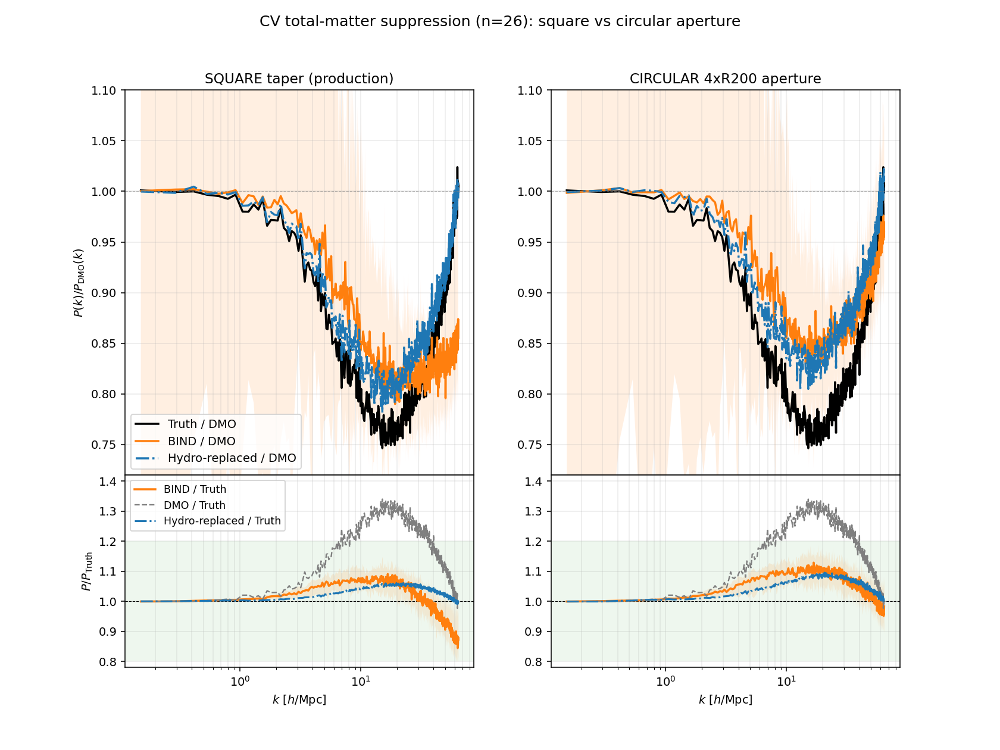

# Circular paste aperture (the standard, `r200_factor = 4.0`)

**As of June 2026 the BIND composite uses a circular paste aperture by default**
(`r200_factor = 4.0`, i.e. each generated halo patch is blended into the full-box
map within a Hann-tapered circle of radius `4 × R200c`). The previous default — a
square Hann taper covering the whole 128² patch (`r200_factor = 0.0`) — is still
available but is now the *legacy* option.

This page records why, with numbers, so the choice is auditable.

## TL;DR

The circular aperture **removes the small-scale total-matter power deficit** that
the square taper leaves, at the cost of a mild over-production at intermediate
scales. The fix is geometric: confining each (slightly over-smooth) generated
patch to a tight aperture raises its concentration and restores the high-`k` power.

## Evidence (26 CV sims, `fm_two_head`)

Total-matter suppression `P(k)/P_DMO`, BIND vs the truth hydro maps. The control
"Hydro-replaced" pastes the *true* hydro patches through the same compositing, so
it isolates the aperture/paste from the emulator.

**BIND / Truth total `P(k)` (1.0 = perfect) by `k`-band [h/Mpc]:**

| aperture | 1–5 | 5–10 | 10–20 | 20–40 | **40–70** |
|---|---|---|---|---|---|
| square (legacy) | 1.03 | 1.07 | 1.07 | 1.02 | **0.894** |
| **circular 4×R200 (default)** | 1.03 | 1.08 | 1.11 | 1.08 | **0.992** |

- Small scales (`k` 40–70): square is **−10.6%**, circular is **−0.8%**.
- The hydro-replaced control shows the square-aperture high-`k` deficit is a *model*
  issue (truth patches reach ~1.0 there; generated patches don't — the cores are
  too smooth). Circular confinement compensates geometrically.
- Trade-off: circular runs +7–11% at `k` 10–40 vs square's +2–7% — all still inside
  the ±20% band. Tune `r200_factor` (3 → 3.5 → 4) to trade intermediate vs small scales.

Reproduce: `tools/paper_cache/build_pk_fixed.py`, which rebuilds the shared-paste
composite and its P(k) for a suite. (The original exploration lived in an
`experiments/` scratch tree that is not tracked in this repository.)

## Caveats / notes

- **Per-channel gas alone:** the square taper actually looks *better* for the gas
  channel in isolation (circular makes gas blobby with empty inter-halo gaps). The
  circular win is specifically for **total matter** `P(k)`. Pick the aperture for
  the target observable.
- **Graceful fallback:** `circular_taper_weight` reverts to the square taper for any
  halo lacking a valid `R200c`, so circular is always safe to leave on.
- **R200c source:** read from the FOF catalog (`Group_R_Crit200`, kpc/h → Mpc/h).
  Cached `halo_catalog.npz` files now expose it directly (`load_halo_catalog` reads
  the legacy kpc/h `radii` key as well as the current Mpc/h `r200s`), so a repaste
  no longer needs to re-read the FOF files.
- **Revert:** pass `--r200_factor 0` to any CLI (or set `RunConfig.r200_factor = 0`)
  for the legacy square taper. A circular composite can always be rebuilt from the
  cached `generated_halos.npz` with `--repaste`, so switching is cheap and reversible.

---

## Shared-content overlap handling (the standard, `paste_mode = "shared"`)

**As of July 2026 the composite additionally shares one realization across
overlapping paste apertures by default** (`paste_mode="shared"` in
`build_bind_composite` / `RunConfig` / `bind.paint`; `"average"` restores the
legacy behavior).

`paste_halos_2d` blends overlapping pastes by weighted *averaging*. Averaging N
independent flow-matching realizations of the same region keeps their
conditional mean but divides the stochastic small-scale variance by ~N — so
wherever apertures overlap, the composite loses exactly the sampled high-k
power. With the historical ≥1e13 halo population overlaps were rare and this
was invisible; at a ≥1e12 floor, 30–50% of the painted area is multi-covered
and the artifact costs **−10% (CV) to −12% (SB35) of total-matter P(k) at
k≈40–70 h/Mpc** (Spearman −0.75 vs the multi-covered fraction across 57 sims).

Two things make this artifact easy to misdiagnose:

- **The hydro-replaced control cannot see it.** Overlapping *truth* patches are
  cutouts of the same map — identical pixels — so their average is a no-op. A
  flat control therefore does not exonerate the paste for generated content.
- It only appears when independent realizations overlap, so it looks like a
  "low-mass halo" content problem when a mass floor is lowered.

The fix mirrors the covering paint: a greedy set-cover in descending halo mass
(`share_overlap_content`) makes any halo whose aperture fits inside a
more-massive halo's patch footprint adopt *that* patch's realization (rolled to
its own frame) before pasting, so overlapping contributions are identical and
the average is lossless. In shared mode `patch_mass_match` operates
*aperture-locally* (weighted content mass matched to the weighted DMO mass in
each footprint — the covering-paint standard), since adopted content is rolled
and whole-patch totals no longer correspond to the halo's own condition cutout.

Validated on the fm_lowmass ≥1e12 suite (fm_thermo epoch064 EMA), median
BIND/Truth at k=40–70: CV 0.969 → 1.059, SB35 0.872 → 0.940; remaining
deviations are model content error, not paste. Fresh covering-paint generation
(one sample per cover box) gives the same result as adoption from existing
per-halo patches. Diagnostics + scripts:
`ceph/paper_cache/fm_thermo/pk_diagnostics/`.
